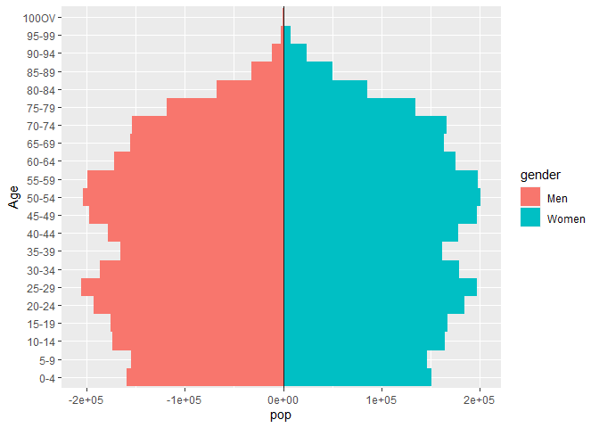
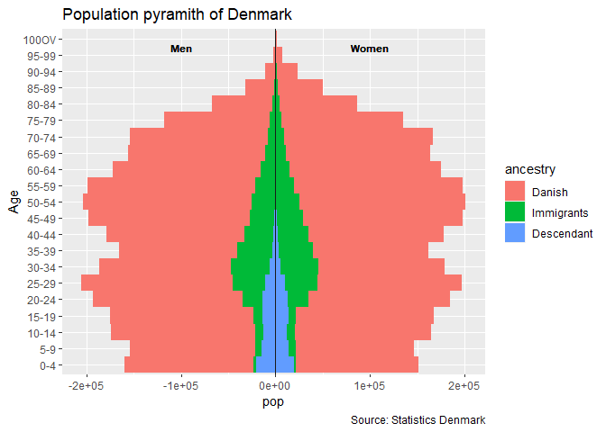
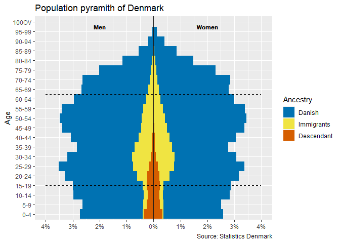

ggpyramid
=========

Overview
--------

*ggpyramid* package provides a function for plotting population pyramids
in {ggplot2}

Installation
------------

    if (!require("remotes")) install.packages("remotes")
    remotes::install_github("javiereliomedina/ggpyramid")

Usage
-----

      library(danstat) 
      library(tidyverse)
      library(ggpyramid)
      library(dint)
      library(forcats)

As an example, I have downloaded some data from [Statistic
Denmark](https://www.dst.dk/en) using the R-package
[danstat](https://cran.r-project.org/web/packages/danstat/vignettes/Introduction_to_danstat.html).

    # Load data from Denmark using (danstat) 
      
      var_pop <- get_table_metadata(table_id = "FOLK1C", variables_only = TRUE)

    ## Define var_input

      # Codes
      var_codes <- c("OMRÅDE", "KØN", "ALDER", "HERKOMST", "Tid")
      
      # Values
      ## Region: Denmark
      id_region <- "000"
      ## Gender: Men/Women
      id_gender <- c(1, 2)
      ## Age (remove total)
      id_age <- subset(var_pop$values[[3]], id != "IALT")$id
      ## Ancestry
      id_ancestry <- c(5, 4, 3)
      ## Quarters
      id_quarter <- "2020K4"

      var_values <- list(id_region, id_gender, id_age , id_ancestry, id_quarter)
      var_input <- purrr::map2(.x = var_codes, .y = var_values, .f = ~list(code = .x, values = .y))
        
    ## Get data 
      data <- get_data("FOLK1C", variables = var_input) %>%
        #Translate into English 
        rename(region = OMRÅDE,
               gender = KØN,
               age = ALDER,
               ancestry = HERKOMST,
               date = TID, 
               pop = INDHOLD) %>% 
        # Format date
        mutate(date = gsub("Q", "", date),
               date = as_date_yq(as.integer(date)),
               date = first_of_quarter(date)) %>% 
        # Format ancestry 
        mutate(ancestry = ifelse(ancestry == "Persons of Danish origin", "Danish", ancestry),
               ancestry = factor(ancestry), 
               ancestry = fct_relevel(ancestry, "Immigrants", after = 1)) %>% 
        # Format age (consecutive levels)  
        mutate(age = ifelse(age == "100 years and over", "100OV", age),
               age = gsub(" years", "", age),
               age = factor(age, levels = id_age))

We can use the default settings for plotting the population pyramid:

    data %>% 
      ggpyramid() 

<!-- -->

We can also use another variable for changing the fill aesthetic
(i.e. ancestry), and use standard *ggplot* functions for adding
additional layers:

    data %>% 
      ggpyramid(fill = ancestry) +
      labs(title = "Population pyramith of Denmark",
           caption = "Source: Statistics Denmark") + 
      annotate(geom = "text",
               y = c(100000 , 100000),
               x = 20.5,
               label = "Women",
               fontface = "bold",
               size = 3) +
      annotate(geom = "text",
               y = c(-100000,-100000),
               x = 20.5,
               label = "Men",
               fontface = "bold",
               size = 3)

<!-- -->

We can also plot the population in percentage:

      brks_y <- seq(-4, 4, 1)
      lmts_y = c(min(brks_y), max(brks_y))
      lbls_y <- paste0(as.character(abs(brks_y)), "%")
      
      data %>% 
        mutate(pop_pct = 100 * pop / sum(pop)) %>% 
        ggpyramid(pop = pop_pct, fill = ancestry) +
        scale_fill_manual(name = "Ancestry", values = c("#0072B2", "#F0E442", "#D55E00")) +
        scale_y_continuous(name = NULL, breaks = brks_y, labels = lbls_y, limits = lmts_y) +
        labs(title = "Population pyramith of Denmark",
             caption = "Source: Statistics Denmark") + 
        geom_segment(data = data, aes(x = 4, xend = 4, y = -4, yend = 4), linetype = "dashed") +
        geom_segment(data = data, aes(x = 13.5, xend = 13.5, y = -4, yend = 4), linetype = "dashed") +
        annotate(geom = "text", y = c(2 , 2),  x = 20.5, label = "Women", fontface = "bold", size = 3) +
        annotate(geom = "text", y = c(-2,-2),  x = 20.5, label = "Men", fontface = "bold", size = 3)

<!-- -->

Notes
=====

I have created this repository during my work as postdoctoral researcher
at Aalborg University, in the project “[Global flows of migrants and
their impact on north European welfare states -
FLOW](https://www.flow.aau.dk)”.

It is not endorsed by the university or the project, and it is not
maintained. All the data I use here are public, and my only aim is that
the repository serves for learning R. For more information about
migration and the project outcomes please visit the project’s website:
<a href="https://www.flow.aau.dk" class="uri">https://www.flow.aau.dk</a>.
